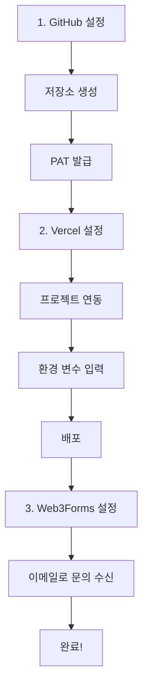

# 플랫폼 설정 가이드 총괄

Zero-Cost Web Factory 프로젝트에서 사용하는 모든 플랫폼의 설정 가이드입니다.
이 프로젝트는 **완전 무료** 원칙을 따르며, 그 어떤 유료 플랜도 필요하지 않습니다.

## 📚 전체 가이드 목록

### 1️⃣ [GitHub 설정 가이드](./github-setup.md)

**필수** | **무료** | **난이도: 중**

GitHub를 데이터베이스 및 저장소로 사용하기 위한 설정:
- ✅ GitHub 계정 생성
- ✅ 저장소 생성
- ✅ Personal Access Token (PAT) 발급
- ✅ 환경 변수 설정

**소요 시간**: 약 10분

---

### 2️⃣ [Vercel 설정 가이드](./vercel-setup.md)

**필수** | **무료** | **난이도: 쉬움**

무료 호스팅 및 자동 배포 설정:
- ✅ Vercel 계정 생성
- ✅ GitHub 저장소 연동
- ✅ 프로젝트 배포
- ✅ 환경 변수 설정
- ✅ 커스텀 도메인 (선택)

**소요 시간**: 약 5분

---

### 3️⃣ [Web3Forms 설정 가이드](../guides/web3forms-setup.md)

**필수** | **무료** | **난이도: 매우 쉬움**

문의 폼에서 이메일로 알림 받기:
- ✅ Web3Forms 가입 (1분)
- ✅ Access Key 발급
- ✅ Vercel 환경변수 설정
- ✅ 이메일로 문의 수신

**소요 시간**: 약 2분

---

## 🗺️ 설정 순서 (권장)

### 통합 설정 프로세스



**필요한 환경 변수 (.env)**:
```env
# 운영 환경 (Production)
GITHUB_OWNER=사용자이름
GITHUB_REPO=저장소이름
GITHUB_BRANCH=master
GITHUB_PERSONAL_ACCESS_TOKEN=ghp_xxxxx
ADMIN_PASSWORD=강력한비밀번호
NEXT_PUBLIC_WEB3FORMS_KEY=xxxxxxxx-xxxx-xxxx-xxxx-xxxxxxxxxxxx
```

**소요 시간**: 15~20분

---

## 💰 비용 요약

| 플랫폼 | 무료 플랜 | 유료 플랜 |
|--------|---------|----------------|
| **GitHub** | ✅ 무제한 DB 저장 | 불필요 |
| **Vercel** | ✅ 호스팅 & 서버리스 함수 | 불필요 |
| **Web3Forms** | ✅ 월 250건 문의 수신 | 선택 ($4/월) |
| **합계** | **$0/월** | $0/월 |

> 💡 **혁신 포인트**: 유료 CMS/호스팅 없이 완전히 0원으로 웹사이트를 운영할 수 있습니다.

## 🎯 주요 기능 및 시나리오

### 제공되는 기능
- **블로그 (Blog)**: 마크다운 기반 포스팅, 태그, 카테고리
- **포트폴리오 (Portfolio)**: 프로젝트 쇼케이스, 이미지 갤러리
- **공지사항 (Notice)**: 중요 알림 관리
- **채용 (Careers)**: 채용 공고 관리
- **이미지 업로드**: 자동 WebP 변환 및 최적화
- **문의 폼**: 이메일 자동 발송

### 추천 시나리오
- **개인 포트폴리오 사이트**: 유지비 0원으로 영구 운영
- **스타트업 랜딩 페이지**: 초기 비용 없이 고퀄리티 사이트 구축
- **기술 블로그**: 개발자 친화적인 마크다운 편집 환경

---

## 🔐 보안 체크리스트

### GitHub
- [ ] PAT 권한 최소화 (Repo 권한만 부여)
- [ ] 토큰 유출 주의 (.env 외 저장 금지)

### Admin 보안
- [ ] `ADMIN_PASSWORD`는 충분히 복잡하게 설정
- [ ] 주기적인 비밀번호 변경 권장

### Vercel
- [ ] 환경 변수 암호화 저장 확인 (기본값)

---

## ❓ 빠른 문제 해결

### "Admin 페이지 접근 불가"
→ `/admin-login` 페이지를 통해 로그인했는지 확인하세요. `ADMIN_PASSWORD` 환경 변수가 설정되어 있어야 합니다.

### "이미지 업로드 실패"
→ `public/uploads` 폴더에 쓰기 권한이 있는지 확인하거나(로컬), Vercel 배포 상태에서는 임시 저장소 특성을 이해해야 합니다.

### "API 500 에러"
→ GitHub PAT 토큰이 만료되지 않았는지, 권한이 올바른지 확인하세요.

## 📞 추가 지원

프로젝트 관련 문의:
- 프로젝트 저장소의 Issues 탭 활용
- [GitHub Docs](https://docs.github.com)
- [Vercel Docs](https://vercel.com/docs)
